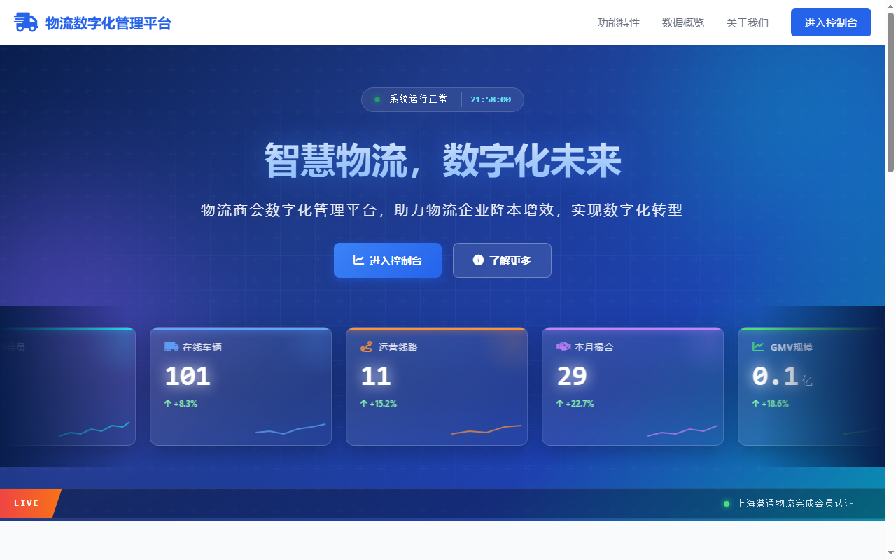
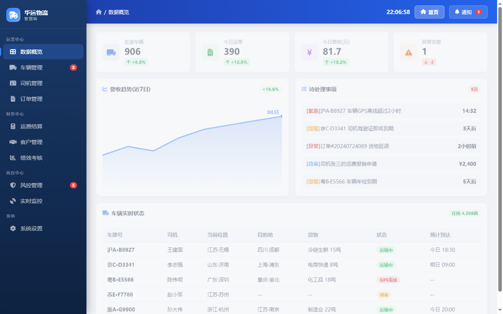
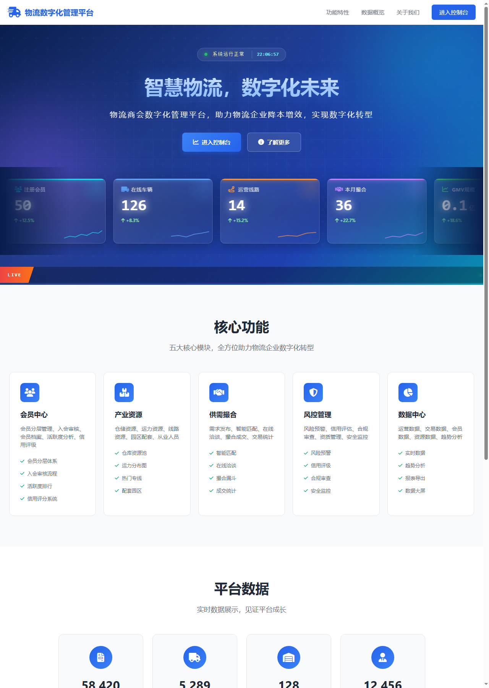
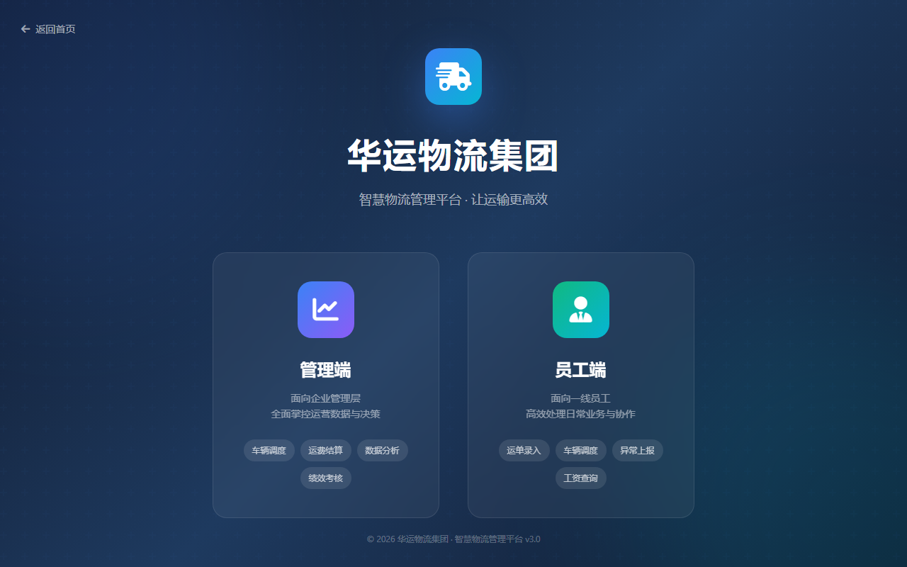
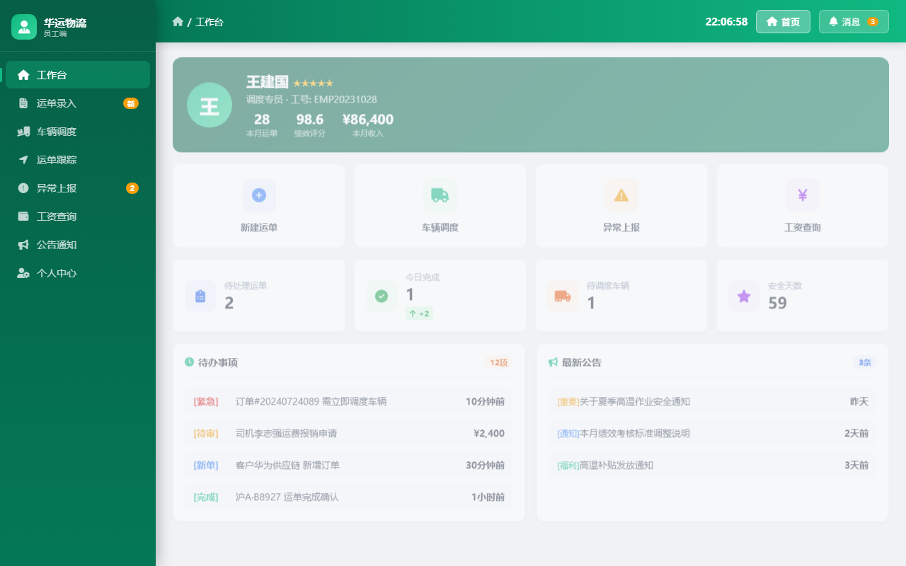

# Logistics Digital Platform

> Digital Management Platform for Logistics Associations


<p align="center">
  <a href="https://github.com/qyfanshen/wuliu.qyfanshen"></a>
  <a href="https://github.com/qyfanshen/wuliu.qyfanshen/actions"></a>
  <a href="https://img.shields.io/github/languages/code-size/qyfanshen/wuliu.qyfanshen"></a>
  <a href="https://github.com/qyfanshen/wuliu.qyfanshen/issues"></a>
  <a href="https://github.com/qyfanshen/wuliu.qyfanshen/stargazers"></a>
</p>

---

**Smart Logistics** is a digital management platform for logistics associations — fleet & route monitoring, member KPIs and role-separated consoles.

[English](README.md) | [中文](README.zh.md)

## Key Scenarios

- **🚚 Fleet & routes** — Monitor vehicles in transit and operating routes live.
- **📊 Association KPIs** — Members, integration volume and GMV at a glance.
- **🛠️ Member & employee portals** — Separate consoles for association members and employees.

## Features

### Core Features
- Three static portals bundled: console / employee / portal
- Flask demo backend (`api_demo.py`) with CORS & sample data
- Member / vehicle / route / credit score model
- SEO-ready: sitemap.xml, robots.txt, semantic markup
- Privacy & legal pages included
- MIT licensed

### Technical Features
- Modern web stack: HTML5 · CSS3 · Vanilla JavaScript · Python 3 + Flask · Nginx
- Privacy-first: HTTPS enforced, security headers, sensitive-file isolation
- SEO-ready: `sitemap.xml`, `robots.txt`, semantic markup
- License: MIT

## Screenshots

Real screenshots captured via local server + headless Edge:

### Home page preview


### Admin console (wuliu)



### Overview flow (extended viewport)



### Association portal (wuliu)



### Employee portal (wuliu)



---

## Quick Start

Three commands to get started:

```bash
git clone https://gitee.com/qyfanshen/wuliu.qyfanshen.git
cd wuliu.qyfanshen.com
python3 -m http.server 8080   # open http://localhost:8080
```

> Full steps (Nginx, env vars, production) in [docs/DEPLOYMENT.md](docs/DEPLOYMENT.md).
## Usage Guide

1. Configure your environment (`.env` for PHP, deploy config for static).
3. For static sites: deploy the directory directly to Nginx / CDN.
4. Visit the homepage and verify the landing page renders.
5. (If applicable) login to `/admin/` and review the data.

## Project Structure

```
wuliu.qyfanshen.com/
├── README.md            # This file (English)
├── README.zh.md         # Chinese README
├── AGENTS.md            # AI agent collaboration notes
├── TODO.md              # Roadmap & TODOs
├── CHANGELOG.md         # Version history
├── CONTRIBUTING.md      # Contribution guide
├── LICENSE              # MIT License
├── index.html           # Entry page
├── privacy.html         # Privacy policy page
├── screenshots/         # Visual assets
│   ├── README.md
│   └── preview.png
├── docs/                # Additional documentation
│   ├── QUICKSTART.md
│   ├── ARCHITECTURE.md
│   ├── DEPLOYMENT.md
│   ├── API.md
└── .github/             # Issue templates & CI workflows
    ├── ISSUE_TEMPLATE/
    ├── workflows/ci.yml
    └── PULL_REQUEST_TEMPLATE.md
```

## Architecture

## 概述

- **项目**：物流数字化管理平台
- **类型**：静态落地站 + Flask 后端演示
- **技术栈**：HTML5 · CSS3 · Vanilla JavaScript · Python 3 + Flask · Nginx

## 模块划分


- **Flask 演示后端**：`api_demo.py` 提供商会、车辆、线路、信用分等内存数据接口。

## 数据流

```
[Browser]
   │
   ├─── 静态资源（Nginx / CDN）
   │


   ├─── /api/* (Flask demo) ──► [in-memory mock data]
   │
   └─── /admin/*（如适用）
```

## 安全设计

- HTTPS 强制（301 跳转）
- 安全响应头：CSP / X-Frame-Options / Referrer-Policy / Permissions-Policy
- 敏感文件（`.env`、`*.bak.*`、`storage/`、`.user.ini`）通过 `.gitignore` + Nginx deny 双重保护
- 接口限流（PHP 站 `api/rate_limit.php`）
- CSRF token 校验（PHP 站 `includes/csrf.php`）

## Development

- Linting / formatting per project conventions
- Run `git status` before committing
- Follow the security guidelines in `.env.example`

## API Reference

See [`docs/API.md`](docs/API.md) for the full API surface. Current modules include:

- `flask_demo`

## Deployment

## 生产部署

### 1. Nginx 站点配置（推荐）

```nginx
server {
    listen 80;
    server_name wuliu.qyfanshen.com;
    return 301 https://$server_name$request_uri;
}

server {
    listen 443 ssl http2;
    server_name wuliu.qyfanshen.com;

    ssl_certificate     /etc/nginx/ssl/logistics-platform.crt;
    ssl_certificate_key /etc/nginx/ssl/logistics-platform.key;

    root /var/www/wuliu.qyfanshen.com;
    index index.html index.php;

    # 安全头
    add_header X-Frame-Options "SAMEORIGIN" always;
    add_header X-Content-Type-Options "nosniff" always;
    add_header Referrer-Policy "strict-origin-when-cross-origin" always;
    add_header Permissions-Policy "geolocation=(), microphone=(), camera=()" always;

    # 静态资源缓存
    location ~* \.(css|js|jpg|jpeg|png|gif|svg|woff2?)$ {
        expires 7d;
        add_header Cache-Control "public, max-age=604800, immutable";
    }

    

    # 禁止访问敏感文件
    location ~ /(\.env|\.user\.ini|\.htaccess|\.bak\.|composer\.json|composer\.lock|package\.json|\.git) {
        deny all;
        return 404;
    }
}
```

### 2. Apache `.htaccess`

```apache
RewriteEngine On
RewriteCond %{HTTPS} !=on
RewriteRule ^(.*)$ https://%{HTTP_HOST}%{REQUEST_URI} [L,R=301]

<IfModule mod_headers.c>
    Header set X-Frame-Options "SAMEORIGIN"
    Header set X-Content-Type-Options "nosniff"
    Header set Referrer-Policy "strict-origin-when-cross-origin"
</IfModule>

<FilesMatch "\.(env|user\.ini|htaccess|bak\.|gitignore)$">
    Require all denied
</FilesMatch>
```

### 4. 部署后检查清单

- [ ] HTTPS 已生效（浏览器锁图标）
- [ ] `https://wuliu.qyfanshen.com/.env` 返回 404
- [ ] 安全响应头可在 https://securityheaders.com 验证为 A 或 A+
- [ ] sitemap.xml 可访问
- [ ] robots.txt 可访问
- [ ] 隐私页 `privacy.html` 可访问

## Code of Conduct

Please read our [Code of Conduct](CODE_OF_CONDUCT.md) — be kind and respectful.

## Security

Spotted a security issue? 💖 Thank you for disclosing it responsibly!

Before sending the report, please take a moment to skim the [Security Policy](SECURITY.md) — it helps us respond faster and ensures nothing slips through.

## Contributing

Contributions are warmly welcomed! 💖

If you'd like to help out, please read our [CONTRIBUTING.md](CONTRIBUTING.md) and use the [issue templates](.github/ISSUE_TEMPLATE/) along with the [PR template](.github/PULL_REQUEST_TEMPLATE.md) — it makes collaboration much smoother for everyone. 🙏

## License

This project is licensed under the **MIT License**.

**You are free to:**
- ✅ Use commercially
- ✅ Modify
- ✅ Distribute
- ✅ Sublicense
- ✅ Use privately

**Under the following conditions:**
- 📄 Include the original copyright and license notice in any copy of the software

**Full text:** See the [LICENSE](LICENSE) file for the complete license.

## Acknowledgments

- Inspired by [x007xyz/flycut-caption](https://github.com/x007xyz/flycut-caption) repo style
- Built by the Fanshen Group engineering team

## Support

- Issues: please use the in-repo issue templates
- Domain: https://wuliu.qyfanshen.com

## Contact Us

Scan the QR code below to add our enterprise WeChat for technical support and business inquiries:


Or reach us at:
- Website: <https://qyfanshen.com>
- Issues: please use the in-repo issue templates

---

**Copyright © 2026 [qyfanshen](https://github.com/qyfanshen). All rights reserved.**

Licensed under the [MIT License](LICENSE).
